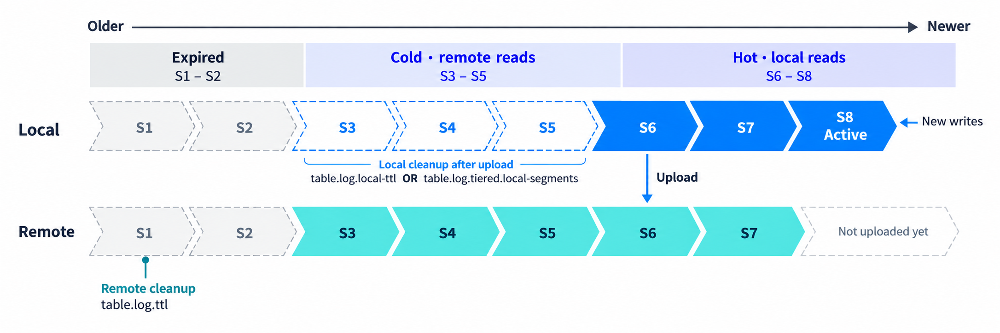
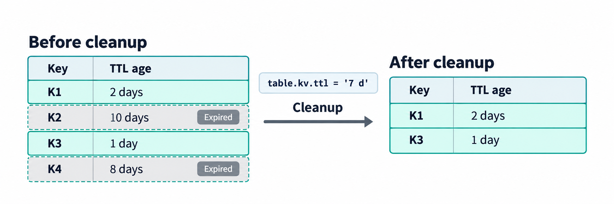
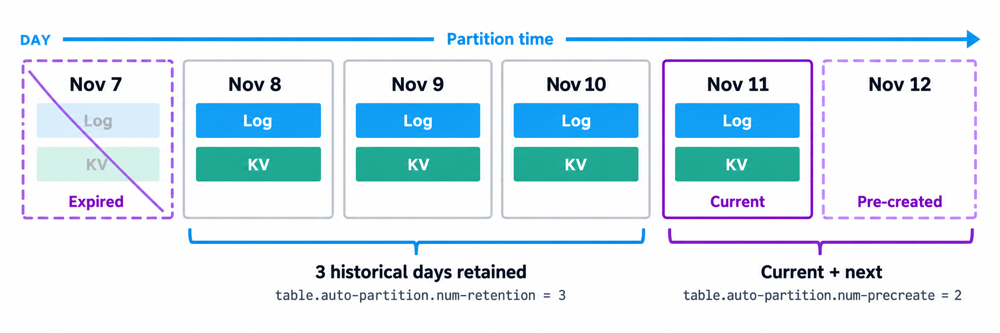

# Data Retention and TTL

Fluss provides three retention mechanisms, which can be configured together:

| Mechanism | What expires | Main configuration |
|---|---|---|
| [Log Retention](#log-retention) | Data logs in log tables; changelogs in primary key tables | `table.log.ttl` |
| [KV Retention](#kv-retention) | Individual rows in a primary key table's KV store | `table.kv.ttl` |
| [Partition Retention](#partition-retention) | Entire time partitions in log tables or primary key tables | `table.auto-partition.*` |

For example, a primary key table can keep its current rows while retaining only one day of changelog.
Expiration is asynchronous, so a TTL is not an exact deadline for data removal or disk-space reclamation.

## Log Retention

### Table Log TTL

Set `table.log.ttl` to control how long logs are retained. The default is **7 days**; `0ms` disables
expiration based on this TTL.

- For **log tables**, this controls the retention of table data.
- For **primary key tables**, this controls changelog history available to consumers. Current KV
  rows remain governed by [KV Retention](#kv-retention).

### Local Log TTL

With [remote log storage](../../maintenance/tiered-storage/remote-storage.md#remote-log) enabled
(the default), local and remote storage serve different purposes:

- **Local storage is the hot tier** for recent data. It serves low-latency tail reads and, with the
  default Apache Arrow log format, supports [column pruning](../../engine-flink/reads.md#column-pruning)
  so streaming consumers read only the columns they need.
- **Remote storage is the cold tier** that keeps older logs readable within the configured log
  retention period, even after their local copies are removed. It supports historical replay and
  consumers catching up beyond the local window. Remote log reads typically have more network
  bandwidth available and do not affect the Fluss cluster's online read and write traffic.

Size local retention to cover the data your tailing consumers need: their expected maximum lag,
plus time for restarts and catching up after backpressure, with some headroom. Size remote retention
for how far back consumers need to replay data. This keeps the hot working set local while using
remote storage for longer history.



The following options control the two tiers:

| Option | Default | Effect |
|---|---|---|
| `table.log.ttl` | `7 d` | Controls remote log retention. |
| `table.log.local-ttl` | Inherits `table.log.ttl` | Controls TTL-based cleanup of local copies. `0ms` disables this cleanup policy. |
| `table.log.tiered.local-segments` | `2` | Controls how many recent local log segments the count-based cleanup policy retains. Must be greater than 0. |

When both TTLs are positive, `table.log.local-ttl` must not exceed `table.log.ttl`. Local copies
can be removed when **either** the local TTL or segment-count limit is reached, after they have
been copied remotely. Setting local TTL to `0ms` leaves count-based cleanup enabled.

For example, if consumers normally lag by at most 30 minutes and need an additional hour for
restarts and catching up, `table.log.local-ttl = '2 h'` is a starting point with some headroom.
Set `table.log.ttl = '7 d'` if consumers need seven days of replay history. Also size
`table.log.tiered.local-segments` to cover that two-hour hot window at peak write rates, accounting
for how frequently segments roll in each bucket. The default of two segments does **not** guarantee
two hours of local data: the segment-count policy may remove local copies before the local TTL
expires. Reads beyond the remaining local window access remote storage.

All three table options support `ALTER TABLE ... SET` and `ALTER TABLE ... RESET`.
See [Updating Configs](../../maintenance/operations/updating-configs.md#updating-table-configs).

<!-- TODO: remove this section when we change `log.retention.roll-active-segment.enabled` default to true in next version -->
### Active-segment Rolling

For low-traffic tables, enable the server option `log.retention.roll-active-segment.enabled` to
allow expired active logs to become eligible for upload and cleanup even when no new data arrives.
It is **disabled by default** and supports
[dynamic cluster updates](../../maintenance/operations/updating-configs.md#updating-cluster-configs).
The expiration time follows the effective local log TTL described above.

When upgrading from v0.9, keep this option disabled until every CoordinatorServer and TabletServer
has been upgraded to v1.0 and the upgrade is complete. Then enable it dynamically as described in
the [1.0 Upgrade Notes](../../maintenance/operations/upgrade-notes-1.0.md#active-segment-retention-rollout).

## KV Retention

### Row TTL for Primary Key Tables

Configure row TTL when creating a primary key table:

| Option | Default | Effect |
|---|---|---|
| `table.kv.ttl` | Disabled when unset | Expires individual KV rows. Must be at least **1 millisecond** when configured. |
| `table.kv.ttl.time-column` | Unset; uses processing time | Uses the specified column's event time to determine row expiration. Requires `table.kv.ttl`. |



For example, this table expires rows after seven days by event time and retains one day of changelog:

```sql title="Flink SQL"
CREATE TABLE pk_table
(
    id BIGINT,
    event_time BIGINT,
    name STRING,
    PRIMARY KEY (id) NOT ENFORCED
) WITH (
    'bucket.num' = '4',
    'table.kv.ttl' = '7 d',
    'table.kv.ttl.time-column' = 'event_time',
    'table.log.ttl' = '1 d'
);
```

Omit `table.kv.ttl.time-column` to use processing time. For event time, the column must be `BIGINT`
epoch milliseconds, `TIMESTAMP`, or `TIMESTAMP_LTZ`. `TIMESTAMP` uses the TabletServer's system
time zone, which must be consistent across servers. Rows with null event-time values do not expire
through row TTL.

Keep these effects and restrictions in mind:

- Expired rows may remain queryable until background cleanup runs.
- KV TTL cleanup **does not emit DELETE records** to changelogs. So `$changelog`/`$binlog` virtual tables and changelog consumers can't observe the `DELETE` event for the TTL cleaned rows. After a row is cleaned up, writing the same key is treated as an insert.
- Both options must be configured at table creation; changing or resetting them is unsupported yet.
- Upgrade all servers to **Fluss 1.0+** before creating a KV-TTL table. Downgrading below 1.0 after
  such a table exists is unsupported.

Existing remote snapshot files have separate retention, controlled by
[`kv.snapshot.num-retained`](../../maintenance/tiered-storage/remote-storage.md#remote-snapshot-of-primary-key-table).

## Partition Retention

Use [auto partitioning](partitioning.md#auto-partitioning) when data should expire in whole time
partitions. It applies to both log tables and primary key tables.

Enable it with `table.auto-partition.enabled = 'true'` (default: `false`), then configure:

| Option | Default | Effect |
|---|---|---|
| `table.auto-partition.time-unit` | `DAY` | Sets the calendar unit for partition creation and expiration. |
| `table.auto-partition.num-retention` | `7` | Retains this many historical time units before the current unit. Older partitions expire. |
| `table.auto-partition.num-precreate` | `2` | Pre-creates this many partitions, including the current one. Does not extend retention. |
| `table.auto-partition.time-zone` | System time zone | Sets the time zone for calendar boundaries. |



For daily partitions with `num-retention = '3'`, on November 11 the retained historical partitions
are November 8–10, in addition to the current partition on November 11. The default pre-creation
count also creates November 12. Writing new rows into an older partition does not extend its retention.

Log and KV TTLs can expire data inside a retained partition. Longer log or KV TTLs do not prevent
the partition itself from expiring. The retention and pre-creation counts support
`ALTER TABLE ... SET` and `ALTER TABLE ... RESET`. See [Partitioning](partitioning.md) for complete
examples and multi-field partition rules.

For lakehouse tables, data already tiered into the lake can remain accessible through Union Read
after Fluss logs or partitions expire, see [Lakehouse Data Retention](../../maintenance/tiered-storage/lakehouse-storage.md#data-retention).

See [Flink Connector Options](../../engine-flink/options.md#storage-options) and
[Server Configuration](../../maintenance/configuration.md#log) for complete configuration references.
